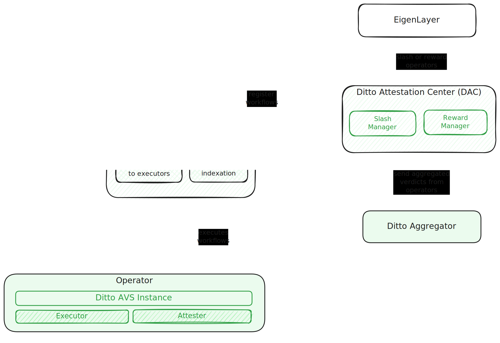

# Ditto AVS Operator

## Introduction

At Ditto, we are developing a system that allows users to execute on-chain transactions based on various triggers in a reliable way. This means users can set up automations without worrying about whether the transactions will be executed or missed. Our solution includes off-chain operators, which any user can run to ensure an affordable and dependable protocol flow. On-chain smart contracts are used to manage the protocol and distribute punishments and rewards.

## Architecture

Our inspiration comes from the Ethereum consensus [specs](https://github.com/ethereum/consensus-specs/tree/dev/specs), [ERC-4337](https://eips.ethereum.org/EIPS/eip-4337) account abstraction, and the tooling provided by EigenLayer. You can see the overall architecture for early stages in the following diagram:

To follow the logic sequentially, read the arrows from left to right in the following order: pink → blue → green → orange. Here's what happens at each stage:

1. Pink: Register on-chain to be included in the active pool in future epochs.
2. Blue: Periodically check the DEP contract for your role in the current slot.
3. Green: Retrieve active workflows from DEP.
4. Orange: Determine a batch of workflows that should be executed. If your role is *attester*, retain this information. If you're an *executor*, send a transaction on-chain.

At some point in the epoch, an attesting task is created. By this time, every *attester* has a history of workflows that should have been executed and can check on-chain to see if the *executor* really carried them out. Votes on this are then aggregated and sent to the chain.

## Operator roles

Each operator engages in two routines at every moment: the execution flow and the validation flow. In each process, the operator can assume one of the given roles for a specific time slot. For execution, the operator can be an active or passive executor. For validation, the operator can be an aggregator or an attester.

An *active executor* is a single operator chosen at each moment to send a transaction on the chain. This operator reviews which active workflows can be executed at that moment (simulation) and creates a batched transaction to run all scheduled workflows.

*Passive executors* are operators who are not the active executor. They perform the same checks as the active executor but, instead of sending a transaction on the chain, they store the simulation result locally for further attesting.

*Attesters* form a committee selected to verify the accuracy of the executor's actions. When an attestation task arises, they cast a vote on the executor's performance accuracy. The task and votes are transmitted through a peer-to-peer connection.

The *aggregator* collects verdicts and is authorized to send the consensus verdict to the chain.

For security reasons we provide the way to delegate workflow runs signature creation to other key. Once operator is registered to our AVS, delegated signer must be set. All following routine transactions must be signed by delegated signer key, not the initial operator key you registered with.

P.S.: In the initial iteration, Ditto will hold the predefined operator, serving as the *aggregator*. This operator will also manage the bootstrap node and the creation of attesting tasks. In the future, we plan to make this role assignable to any operator.

## Contracts

### Ditto Entry Point

The Ditto Entry Point is a key component of a sophisticated automation system, working with Ditto vaults and other smart contracts to manage and execute automated workflows. Together they form a reliable and efficient system for executing smart contract workflows. Here’s a concise overview:

1. **Workflow Registration**:
    - Ditto vaults or other smart contracts can register workflows in the Ditto Entry Point.
    - Users specify the maximum gas limit and gas price for each workflow, ensuring control over execution costs.
2. **Prefunding Mechanism**:
    - Before execution, the `payPrefund` function secures necessary gas funds from the vault.
    - This ensures adequate resources are available for workflow execution.
3. **Prefund Limitations**:
    - The Ditto Entry Point cannot withdraw more funds than initially registered, preventing overcharges.
4. **Execution and Compensation**:
    - **Successful Execution**: Executors receive full compensation, a fixed reward.
    - **Unsuccessful Execution**: Executors receive partial compensation, discouraging faulty workflows but ensuring fairness.
5. **Incentives** **Alignment:**
    - Protocol Fees store compensation and reward parameters defined in a specific way.  Executor does not get full compensation for spent gas but is net-profiting cause of additional fixed reward incentivizing effective gas price calculation.
6. **Workload Distribution**:
    - Workloads are distributed among executors based on weighted delegated stakes, ensuring balanced task allocation.
7. **Compliance with Protocol Fees**:
    - Protocol Fees Contract holds parameters defining the compensation and reward amounts.

### Epoch and Stake Management

The contract manages epochs to ensure fair workload distribution among executors based on their stakes.

### Gas Limit and Price Specifications

By allowing users to control gas limits and prices, it ensures cost-effective and secure automation for decentralized applications.

Users must specify:

- **Maximum Gas Limit**: The upper limit of gas for workflow execution.
- **Maximum Gas Price**: The highest gas price they are willing to pay, safeguarding against high costs.

## AVS Operator Guide

Currently, the operator's flow consists of two parallel actions: running the operator node and explicitly sending transactions to share intentions with the protocol (either to become an active validator or to end validation and safely exit the validators pool). In the future, we could consider automating the emission of explicit transactions as part of the executor node function.

Running executor:

1. Download a binary.
2. Set env variable with private key: `export OPERATOR_PRIVATE_KEY=<operator's hex private key without 0x prefix>`
3. Register your operator in AVS: `./operator register --node-url <node_url> --contract-addr <contract_addr>`
4. Set delegated signer: `./bin/operator set-signer --node-url <node_url> --contract-addr <contract_addr> --address <delegated signer address 0x...>`
5. Replace env variable with delegated signer's private key: ``export OPERATOR_PRIVATE_KEY=<<delegated signer's hex private key without 0x prefix>>`
6. Launch a binary as `./bin/operator run --node-url <node_url> --contract-addr <contract_addr>`
7. Wait until rearrangement happens (epoch increment). Firstly, you’ll observe *not executor* messages, then it will become either *Not my turn to execute* or info about active workflows in case if it is your turn. You’re now in forever loop, being a part of executors network.
8. To deregesiter operator from AVS, run `./operator deregister --node-url <node_url> --contract-addr <contract_addr>` with `OPERATOR_PRIVATE_KEY` env set to operator's private key from step 2.

## Deployments
### Holesky Testnet Deployments
| Name | Proxy |
| ---- | ---- |
| DittoEntryPoint |[`0xb7595CaF0d362bFBF89D9E64e1583B8238841CeB`](https://holesky.etherscan.io/address/0xb7595CaF0d362bFBF89D9E64e1583B8238841CeB)|

## Developer guide

### Code generation
`make abi-gen` - to generate Go code from abi files
