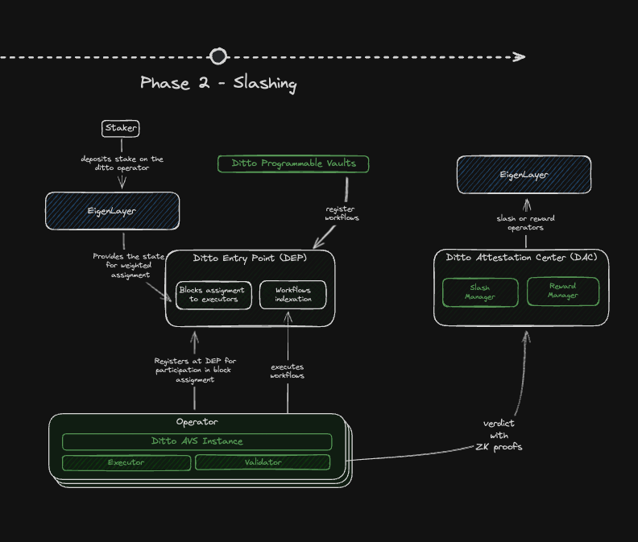

# Ditto AVS Operator

## Introduction

At Ditto, we are developing a system that allows users to execute on-chain transactions based on various triggers in a
reliable way. This means users can set up automations without worrying about whether the transactions will be executed
or missed. Our solution includes off-chain operators, which any user can run to ensure an affordable and dependable
protocol flow. On-chain smart contracts are used to manage the protocol and distribute punishments and rewards.

## Architecture

Our inspiration comes from the Ethereum
consensus [specs](https://github.com/ethereum/consensus-specs/tree/dev/specs), [ERC-4337](https://eips.ethereum.org/EIPS/eip-4337)
account abstraction, and the tooling provided by EigenLayer. You can see the overall architecture for phase #1 in the
following diagram:

### Phase #1 (current)


The diagram shows the following steps:

1. **Operator register at DEP** - Register on-chain to be included in the active pool in future epochs.
2. **Check DEP for activity status** - Periodically check the DEP contract for your role in the current slot.
3. **Retrieve active workflows from DEP** - Retrieve active workflows from DEP.
4. **Determine a batch of workflows that should be executed** - Send a transactions on-chain.

### Phase #2 (future)

_*This phase is under development and there may be some changes in the schemes and the architecture._


The diagram shows the following steps:

1. **Operator register at DEP** - Register on-chain to be included in the active pool in future epochs.
2. **Check DEP for role** - Periodically check the DEP contract for your role in the current slot.
	1. If the operator is an active executor, they will:
		1. **Retrieve active workflows from DEP** - Retrieve active workflows from DEP.
		2. **Determine a batch of workflows that should be executed** - Send a transactions on-chain.
	2. If the operator is an active validator, they will:
		1. **Generate proof of execution of the workflows referring missing executions** - Send verdict with ZK proofs
		   to Ditto Attestation Center.

## Operator roles

Each operator engages in two routines at every moment: the execution flow and the validation flow. In each process, the
operator can assume one of the given roles for a specific time slot.

An *active executor* is a single operator chosen at each moment to send a transaction on the chain. This operator
reviews which active workflows can be executed at that moment (simulation) and creates a batched transaction to run all
scheduled workflows.

For security reasons we provide the way to delegate workflow runs signature creation to other key. Once operator is
registered to our AVS, delegated signer must be set. All following routine transactions must be signed by delegated
signer key, not the initial operator key you registered with.

P.S.: In the initial iteration, Ditto will hold the predefined operator. This operator will
also manage the bootstrap node and the creation of attesting tasks. In the future, we plan to make this role assignable
to any operator.

## Contracts

### Ditto Entry Point

The Ditto Entry Point is a key component of a sophisticated automation system, working with Ditto vaults and other smart
contracts to manage and execute automated workflows. Together they form a reliable and efficient system for executing
smart contract workflows. Here’s a concise overview:

1. **Workflow Registration**:
	- Ditto vaults or other smart contracts can register workflows in the Ditto Entry Point.
	- Users specify the maximum gas limit and gas price for each workflow, ensuring control over execution costs.
2. **Prefunding Mechanism**:
	- Before execution, the `payPrefund` function secures necessary gas funds from the vault.
	- This ensures adequate resources are available for workflow execution.
3. **Prefund Limitations**:
	- The Ditto Entry Point cannot withdraw more funds than initially registered, preventing overcharges.
4. **Execution and Compensation**:
	- **Successful Execution**: Executors receive full compensation, a fixed reward.
	- **Unsuccessful Execution**: Executors receive partial compensation, discouraging faulty workflows but ensuring
	  fairness.
5. **Incentives** **Alignment:**
	- Protocol Fees store compensation and reward parameters defined in a specific way. Executor does not get full
	  compensation for spent gas but is net-profiting cause of additional fixed reward incentivizing effective gas price
	  calculation.
6. **Workload Distribution**:
	- Workloads are distributed among executors based on weighted delegated stakes, ensuring balanced task allocation.
7. **Compliance with Protocol Fees**:
	- Protocol Fees Contract holds parameters defining the compensation and reward amounts.

### Epoch and Stake Management

The contract manages epochs to ensure fair workload distribution among executors based on their stakes.

### Gas Limit and Price Specifications

By allowing users to control gas limits and prices, it ensures cost-effective and secure automation for decentralized
applications.

Users must specify:

- **Maximum Gas Limit**: The upper limit of gas for workflow execution.
- **Maximum Gas Price**: The highest gas price they are willing to pay, safeguarding against high costs.

## AVS Operator Guide

---
**Requirements:**

- **AMD64** server running **Linux**

**Dependencies:**

- Docker ([installation guide](https://docs.docker.com/engine/install/))
- WSS RPC endpoint (e.g., Infura, Alchemy,
  etc.) ([Infura guide](https://infura.io/docs/gettingStarted/connect-to-infura))

### Usage

Currently, the operator's flow consists of two parts: firstly, you need to register as AVS operator and set delegated
signer, secondly, you need to run Docker container as a daemon. You system will be kept clean, every command is executed
inside container. You will find `<contract_addr>` in **Deployments** section below.

### 1. Download Docker container

```bash
$ docker pull dittonetwork/avs-operator
```

### 2. Generate key/address pairs

_If you don't have key/address pairs yet, you could generate one_

```bash
$ docker run --rm dittonetwork/avs-operator generate
```

### 3. Register as AVS operator

_Register your operator using the command below:_

```bash
$ docker run --rm --env OPERATOR_PRIVATE_KEY dittonetwork/avs-operator register \
	--node-url <node_url> \
	--contract-addr <contract_addr>
```

**Arguments:**

1. `node-url` — Specifies the WebSocket (WSS) URL of the blockchain node to interact with. This URL is used to make
   contract calls, send transactions, and receive real-time updates via WebSocket connections. The node can be a local
   full node, a hosted node, or a service provider’s endpoint (e.g., Infura, Alchemy). Ensure that the node has the
   necessary access and permissions for your operations. Example: wss://mainnet.infura.io/ws/v3/YOUR-PROJECT-ID.
2. `contract-addr` — Specifies the address of the Ditto Entry Point contract.
3. `OPERATOR_PRIVATE_KEY` — Specifies the private key of the operator.

**Example:**

Setting up the environment variable:

```bash
$ export OPERATOR_PRIVATE_KEY=0x
```

Running the command:

```bash
$ docker run --rm --env OPERATOR_PRIVATE_KEY dittonetwork/avs-operator register \
	--node-url wss://silent-tame-seed.ethereum-holesky.quiknode.pro/1234 \
	--contract-addr 0x5FD0026a449eeA51Bd1471E4ee8df8607aaECC24
```

### 4. Set delegated signer

_Keep in mind this address must have enough ETH to cover initial transactions. We recommend to deposit 0.01 ETH._

```bash
$ docker run --rm --env OPERATOR_PRIVATE_KEY dittonetwork/avs-operator set-signer \
	--node-url <node_url> \
	--contract-addr <contract_addr> \
	--address <delegated signer address 0x...>
```

**Arguments:**

1. `node-url` — Specifies the WebSocket (WSS) URL of the blockchain node to interact with. This URL is used to make
   contract calls, send transactions, and receive real-time updates via WebSocket connections. The node can be a local
   full node, a hosted node, or a service provider’s endpoint (e.g., Infura, Alchemy). Ensure that the node has the
   necessary access and permissions for your operations. Example: wss://mainnet.infura.io/ws/v3/YOUR-PROJECT-ID.
2. `contract-addr` — Specifies the address of the Ditto Entry Point contract.
3. `address` — Specifies the address of the delegated signer.

**Example:**

Running the command:

```bash
$ docker run --rm --env OPERATOR_PRIVATE_KEY dittonetwork/avs-operator set-signer \
	--node-url wss://silent-tame-seed.ethereum-holesky.quiknode.pro/1234 \
	--contract-addr 0x5FD0026a449eeA51Bd1471E4ee8df8607aaECC24 \
	--address 0x...
```

### 5. Launch a daemon

Operator will activate itself automatically.

```bash
$ docker run --name ditto-operator --env EXECUTOR_PRIVATE_KEY --restart unless-stopped -d dittonetwork/avs-operator run \
	--node-url <node_url> \
	--contract-addr <contract_addr>
```

Arguments:

1. `node-url` — Specifies the WebSocket (WSS) URL of the blockchain node to interact with. This URL is used to make
   contract calls, send transactions, and receive real-time updates via WebSocket connections. The node can be a local
   full node, a hosted node, or a service provider’s endpoint (e.g., Infura, Alchemy). Ensure that the node has the
   necessary access and permissions for your operations. Example: wss://mainnet.infura.io/ws/v3/YOUR-PROJECT-ID.
2. `contract-addr` — Specifies the address of the Ditto Entry Point contract.
3. `EXECUTOR_PRIVATE_KEY` — Specifies the private key of the delegated signer.
4. `--restart unless-stopped` — Specifies that the container should be restarted unless it is stopped manually.

**Example:**

Setting up the environment variable:

```bash
$ export EXECUTOR_PRIVATE_KEY=0x
```

Running the command:

```bash
$ docker run --name ditto-operator --env EXECUTOR_PRIVATE_KEY --restart unless-stopped -d dittonetwork/avs-operator run \
	--node-url wss://silent-tame-seed.ethereum-holesky.quiknode.pro/1234 \
	--contract-addr 0x5FD0026a449eeA51Bd1471E4ee8df8607aaECC24
```

### 6. Monitor AVS operator logs

```bash
$ docker logs ditto-operator
```

### 7. Graceful Shutdown and Deactivation

On a graceful shutdown, the operator will deactivate automatically. However, if you need to force deactivate, use this
command:

```bash
docker run --rm --env EXECUTOR_PRIVATE_KEY dittonetwork/avs-operator deactivate \
	--node-url <node_url> \
	--contract-addr <contract_addr>
```

Arguments:

1. `node-url` — Specifies the URL of the blockchain node to interact with.
2. `contract-addr` — Specifies the address of the Ditto Entry Point contract.
3. `EXECUTOR_PRIVATE_KEY` — Specifies the private key of the delegated signer.

> **ATTENTION!** Wait until rearrangement happens (epoch increment).
> You could attach to container logs. Firstly, you’ll observe *not executor* messages,
> then it will become either *Not my turn to execute* or info about active workflows in case if it is your turn.
> You’re now in a forever loop, being a part of the executors network. Congrats ^^

### 8. Deregister operator

```bash
$ docker run --rm --env OPERATOR_PRIVATE_KEY dittonetwork/avs-operator deregister \
	--node-url <node_url> \
	--contract-addr <contract_addr>
```

Arguments:

1. `node-url` — Specifies the URL of the blockchain node to interact with.
2. `contract-addr` — Specifies the address of the Ditto Entry Point contract.
3. `OPERATOR_PRIVATE_KEY` — Specifies the private key of the operator.

**Example:**

Running the command:

```bash
$ docker run --rm --env OPERATOR_PRIVATE_KEY dittonetwork/avs-operator deregister \
	--node-url wss://silent-tame-seed.ethereum-holesky.quiknode.pro/1234 \
	--contract-addr 0x5FD0026a449eeA51Bd1471E4ee8df8607aaECC24
```

## Deployments

### Holesky Testnet Deployments

| Name            | Proxy                                                                                                                           |
|-----------------|---------------------------------------------------------------------------------------------------------------------------------|
| DittoEntryPoint | [`0x5FD0026a449eeA51Bd1471E4ee8df8607aaECC24`](https://holesky.etherscan.io/address/0x5FD0026a449eeA51Bd1471E4ee8df8607aaECC24) |

## Developer guide

### Code generation

`make abi-gen` - to generate Go code from abi files
